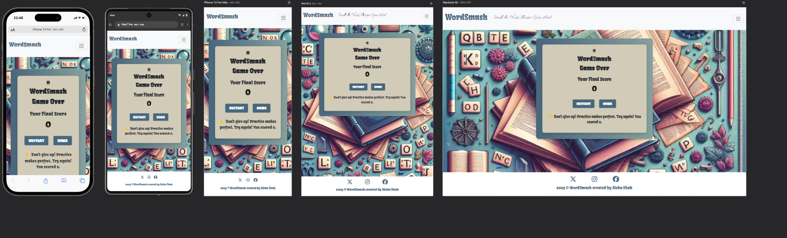

## Testing

### Compatibility

In order to confirm the correct functionality, responsiveness, and
appearance:

- The website was tested on the following browsers: Chrome, Firefox,
Safari.

| Browser tested | Intended appearance | Intended responsiveness |
| --- | --- | --- |
| Chrome | Good | Good |
| FireFox | Good | Good |
| Safari | Good | Good |

### Responsiveness

The functionality of the links in the website was checked as well by
different users. The website was checked by extension
“**Responsive Viewer**” in Chrome.

**Screen sizes**
- iphone 14 pro 393x852 (Minor difference in appearance between Edge/Safari and Chrome)
- Pixel 7 Pro 480x1040
- Iphone 14 pro max 430x932
- ipad air 5 820x1180
- Macbook Air 1559x975

- **Home page**

- **How to Play page**
    
    

    

- **Start Game page**
    
    

- **Result page**

### Validator testing

#### HTML

- **Home page**
    
    

- **Rule page**
    
    
    
- **Start Game page**
    
    

- **End Game page**
    
    

 #### CSS

No errors or warnings were found when passing through the official
W3C validator.

   

#### JavaScript

I have used the recommended [JShint Validator](https://jshint.com/) to validate all of my JS files.

**randomwords.js**

assets/js/randomwords.js

**startgame.js**

assets/js/startgame.js

**Endgame.js**

assets/js/endgame.js

### LightHouse report

- Using lighthouse in devtools I confirmed that the website is
performing well, with great SEO, accessible and colours and fonts chosen
are readable.

**Home page**

Desktop:

Mobile:

**How to play page**

Desktop:

**End Gamepage**

Desktop:

Mobile:

# Manual Testing Plan

### Overview
This document outlines the test cases, expected results, and testing outcomes for the various features of the WordSmash application.

---
| **Feature** | **Test case** | **Expected result** | **Tested** | **Passed** |
| --- | --- | --- | --- | --- | 
| Navbar |  |  |  |  |  |
| Logo | Click on the Logo on each page | The user is redirected to the Home page | Yes | Yes | . 
| Hamburger menu | Click on the Hamburger menu on each page | The navigation menu is successfully displayed | Yes | Yes |  |
| Home Page Link Functionality | Click on the Home Page Link on each page | The user is redirected to the home page. | Yes | Yes .|
| How to play Link Functionality | Click on the “Rules/How to play” link on each page | The user is redirected to the Rules page | Yes | Yes | 
|Start game  | Click on the “Start game” link on each page | The user is redirected to the game page | Yes | Yes | 

| **Feature** | **Test case** | **Expected result** | **Tested** | **Passed** |
| --- | --- | --- | --- | --- |
| Instagram icon       | Click on the Instagram icon     | The user is redirected to the Instagram page in a new window           | Yes        | Yes        | Confirm that a hover effect is triggered, and the color of the icon changes. |
| Facebook icon        | Click on the Facebook icon      | The user is redirected to the Facebook page in a new window            | Yes        | Yes        | Confirm that a hover effect is triggered, and the color of the icon changes. |
| Twitter icon         | Click on the Twitter icon       | The user is redirected to the Twitter page in a new window             | Yes        | Yes        | Confirm that a hover effect is triggered, and the color of the icon changes. |

| **Feature** | **Test case** | **Expected result** | **Tested** | **Passed** |
| --- | --- | --- | --- | --- |
| How to Play Button Functionality | Click on the "How to play" button to open the rules page|  The instructions modal appears on the screen. | Yes | Yes |  
| Start Game Button Functionality | Click on the start game Button | The user is redirected to the "Game" page | Yes | Yes | 
|  Next word and Back to home Options | Click on any of the option buttons and you are directed to related pages| . | Yes | Yes | The buttons remain in place. |
| Back to Home Page Link | Click on the "Back toHome Page" link | Upon clicking the link, user will be redirected to home page. | Yes | Yes |  |
Game Features 
|Random Word Display| On page load, verify a random word of the day is displayed.| A random word and its definition are displayed.|	Yes | Yes |	
| Keyboard Interaction | Click any letter on the keyboard during gameplay.|Correctly guessed letters appear in the blanks; incorrect guesses decrease lives.| Yes | Yes|	
|Used letter disabled| The letters are clicked only once during the round.| Already guessed letters are disabled and appear in grey| Yes | Yes|	
| Hint Display | Verify the hint displayed matches the current word.| A relevant hint is displayed for each word.|	Yes |	Yes |	
| Timer Functionality |	Allow the timer to run out during a round.|	Timer reaches zero, and the word is marked as incorrect.|	Yes| Yes |
| Score and Lives Update |	Guess letters correctly or incorrectly and check the score and lives.| Score increases for correct guesses; lives decrease for incorrect guesses.|	Yes	| Yes |	
| End Game Redirection | Complete the game and verify redirection to the endgame page.|	The user is redirected to "endgame.html" with the final score displayed.|	Yes	| Yes |
| Restart Game |	Click the restart game button.|	Game resets to the first word with default score and lives.| Yes | Yes |	
| Next Word Button | Click the "Next Word" button during gameplay.|	The next word and corresponding hint are displayed.| Yes |Yes and the button is hidden when there are no more words to display.|
|Result Page|					
|Restart Button|	Click the "Restart" button on the result page.|	Game restarts from the first word. | Yes | Yes |
|Home Page Link|	Click the "Home Page" link on the result page.|	User is redirected to the home page. |	Yes	| Yes |

## User Stories Manual Testing

### First-Time User Goals
- **As a first-time player, I want to start a new game easily so I can begin playing WordSmash without any hassle.**  
  | **Test Case**      | **Steps** | **Expected Result** | **Outcome**  |
  | --- | --- | --- | --- |
  | Start a New Game   | 1. Open the game's homepage. 2. Click "Start Game". | The game should start, and the player should be directed to the game page with the first word displayed. | Successful   |

- **As a first-time player, I want to view clear game rules so I can understand how to play before starting.**  
  | **Test Case** | **Steps** | **Expected Result** | **Outcome**  |
  | --- | --- | --- | --- |
  | Provide Clear Gameplay Instructions | 1. Click on the "How to Play" button.   | A modal/page explaining game mechanics and scoring should appear. | Successful   |

- **As a first-time player, I want the game to look attractive and be easy to navigate so I can enjoy the experience right away.**  
  | **Test Case**  | **Steps** | **Expected Result**  | **Outcome**  |
  | --- | --- | --- | --- |
  | Attractive Interface Design | 1. Navigate through all pages. 2. Observe layout and graphics. | Interface should be visually appealing with clear navigation.  | Successful |

### Returning Player Goals
- **As a returning player, I want to see my current score during the game so I can monitor my improvement.**  
  | **Test Case** | **Steps** | **Expected Result**  | **Outcome**  |
  | --- | ---  | ---  | --- |
  | Track Current Score | 1. Start a new game. 2. Observe score updates after answering. | The score should update dynamically after each correct answer. | Successful |

- **As a returning player, I want feedback on my guesses so I can learn new words and improve my vocabulary.**  
  | **Test Case**   | **Steps**  | **Expected Result** | **Outcome**  |
  | --- | --- | --- | --- |
  | Feedback on answers | 1. Start a game. 2. Answer correctly or incorrectly. | Immediate feedback should indicate correctness, with visual highlights adn supporting text. | Successful |

- **As a returning player, I want the option to restart the game after finishing so I can try to beat my previous score.**  
  | **Test Case** | **Steps** | **Expected Result** | **Outcome**  |
  | ---  | ---  | --- | --- |
  | Restart Game | 1. On results page, click "Restart Game". | Game should reset, presenting fresh word challenges and resetting progress. | Successful |

### Frequent Player Goals
- **As a frequent player, I want each word challenge to include a timer so I can enjoy a fast-paced and exciting experience.**  
  | **Test Case** | **Steps**  | **Expected Result** | **Outcome**  |
  | ---   | --- | --- | --- |
  | Timer for Each Challenge | 1. Start a game. 2. Observe timer. | Timer should appear for each word, clearly showing remaining time. | Successful   |

- **As a frequent player, I want the game to work well on any device or screen size so I can play on my preferred platform anytime.**  
  | **Test Case**  | **Steps**  | **Expected Result** | **Outcome**  |
  | ---  | --- | --- | --- |
  | Cross-Device Compatibility | 1. Open game on desktop, tablet, and mobile. 2. Test in different browsers. | Game should load and function smoothly across devices and browsers. | Successful   |

- **As a frequent player, I want new word puzzles and updates so the experience remains fresh and engaging.**  
  | **Test Case**                    | **Steps**                        | **Expected Result**                          | **Outcome**  |
  | --- | ---  | --- | --- |
  | Create Engaging Word Challenges along with Learn a new word feature| 1. Start game. 2. Review word pool. | Everytime the home page is revisited new word can be seen. | Successful   |

### Conclude the Game Effectively
- **As a player, I want the game to end automatically and display my final score.**  
  | **Test Case** | **Steps** | **Expected Result**  | **Outcome**  |
  | --- | --- | --- | --- |
  | End Game and View Final Score | 1. Complete all word challenges. | Game should end automatically, transitioning to results page with the final score displayed. | Successful |

## Fixed Bugs
### 1. Bug Description: **Timer Issues**

**Problem:** Timer was not resetting properly between rounds as it did not clear the setInterval timer before starting a new one.

**Solution:**  Used clearInterval(timer) before starting a new setInterval.

### 2. Bug Description: **Words Repeating**

**Problem** Words were repeating before the entire word list was exhausted due to lack of tracking for already-used words in the words array.

**Solution:** Properly used the currentWordIndex to track the current word, and ensured the index only increments.

### 3. Bug Description: **Keyboard Not Re-Rendering**

**Problem** The on-screen keyboard did not refresh correctly after moving to the next word.

**Solution:**  Rebuilt the keyboard in the createKeyboard() function every time a new word was displayed.

### 4. **Bug Description**

**Problem** Clicking on incorrect letters provided no feedback or reduced lives multiple times per click.

**Solution:** Ensured lives decrement only once for each incorrect guess and provided immediate visual feedback.Also added (keyboardButtons) in handleLetterClick(letter) function so that when user clicks a letter, it loops through all the keyboard buttons and disable the button that matches the clicked letter (button.textContent === letter).

### Unsolved Bugs

To the best of my knowledge, there are no unresolved bugs at the
moment.

### Mistakes

Initially, I did not document bugs as they arose during the coding process.
I have since recognized the importance of logging bugs in real-time for more effective tracking and resolution.
For future projects, I will ensure to keep a thorough record of all bugs encountered and their resolution steps throughout the development process.

