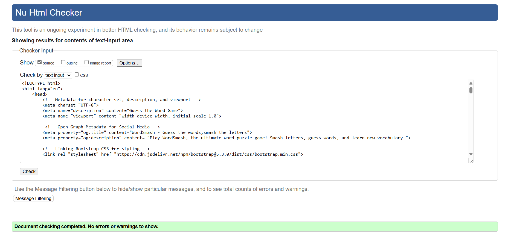
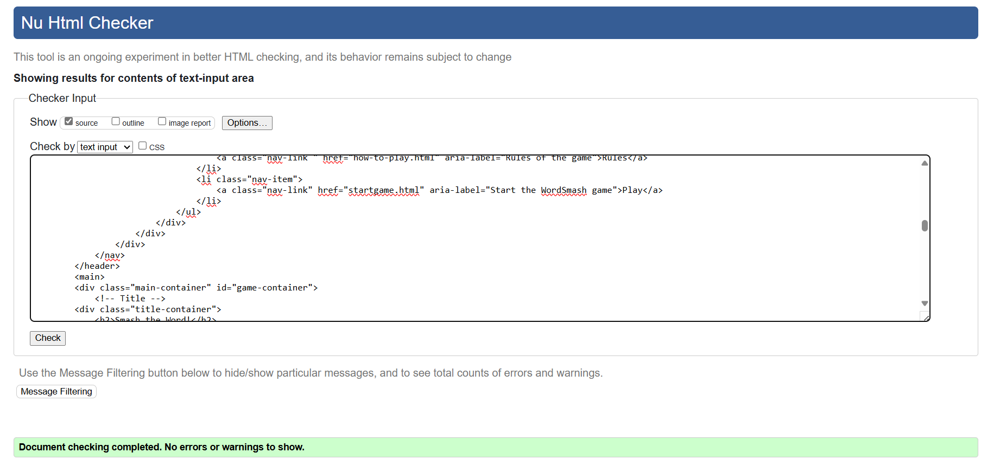
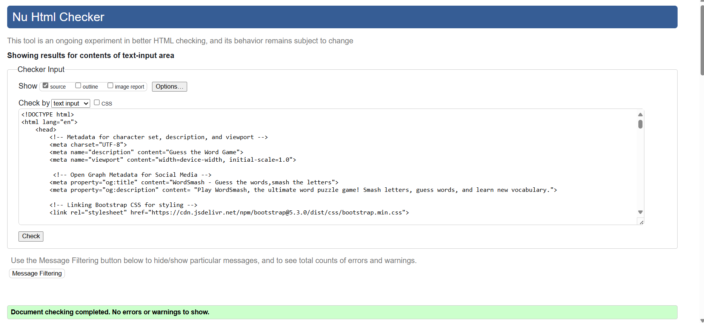
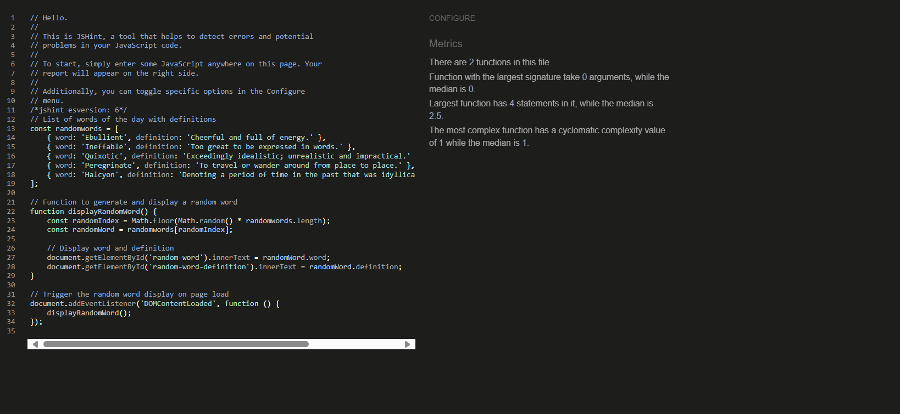

## Testing

### Responsiveness

The functionality of the links in the website was checked as well by
different users. The website was checked by extension
“**Responsive Viewer**” in Chrome.

Screen sizes

- **Home page**

- **Rule page**
    
    

- **Start Game page**
    
    

- **Result page**

### Validator testing

#### HTML

- **Home page**
    
    

- **Rule page**
    
    
    
- **Start Game page**
    
    

- **End Game page**
    
    

 #### CSS

No errors or warnings were found when passing through the official
W3C validator.

   

#### JavaScript

I have used the recommended [JShint Validator](https://jshint.com/) to validate all of my JS files.

**randomwords.js**

assets/js/randomwords.js

**startgame.js**

assets/js/startgame.js

**Endgame.js**

assets/js/endgame.js

### LightHouse report

- Using lighthouse in devtools I confirmed that the website is
performing well, with great SEO, accessible and colours and fonts chosen
are readable.

**Home page**

Desktop:

Mobile:

**Rule page**

Desktop:

**End Gamepage**

Desktop:

Mobile:

# Manual Testing Plan

### Overview
This document outlines the test cases, expected results, and testing outcomes for the various features of the WordSmash application.

---
| **Feature** | **Test case** | **Expected result** | **Tested** | **Passed** |
| --- | --- | --- | --- | --- | 
| Navbar |  |  |  |  |  |
| Logo | Click on the Logo on each page | The user is redirected to the Home page | Yes | Yes | . 
| Hamburger menu | Click on the Hamburger menu on each page | The navigation menu is successfully displayed | Yes | Yes |  |
| Home Page Link Functionality | Click on the Home Page Link on each page | The user is redirected to the home page. | Yes | Yes .|
| How to play Link Functionality | Click on the “Rules/How to play” link on each page | The user is redirected to the Rules page | Yes | Yes | 
|Start game  | Click on the “Start game” link on each page | The user is redirected to the game page | Yes | Yes | 

| **Feature** | **Test case** | **Expected result** | **Tested** | **Passed** |
| --- | --- | --- | --- | --- |
| Instagram icon       | Click on the Instagram icon     | The user is redirected to the Instagram page in a new window           | Yes        | Yes        | Confirm that a hover effect is triggered, and the color of the icon changes. |
| Facebook icon        | Click on the Facebook icon      | The user is redirected to the Facebook page in a new window            | Yes        | Yes        | Confirm that a hover effect is triggered, and the color of the icon changes. |
| Twitter icon         | Click on the Twitter icon       | The user is redirected to the Twitter page in a new window             | Yes        | Yes        | Confirm that a hover effect is triggered, and the color of the icon changes. |

| **Feature** | **Test case** | **Expected result** | **Tested** | **Passed** |
| --- | --- | --- | --- | --- |
| How to Play Button Functionality | Click on the "How to play" button to open the rules page|  The instructions modal appears on the screen. | Yes | Yes |  
| Start Game Button Functionality | Click on the start game Button | The user is redirected to the "Game" page | Yes | Yes | 
|  Next word and Back to home Options | Click on any of the option buttons and you are directed to related pages| . | Yes | Yes | The buttons remain in place. |
| Back to Home Page Link | Click on the "Back toHome Page" link | Upon clicking the link, user will be redirected to home page. | Yes | Yes |  |
| Confirm Redirecting | Click on the "OK" button in the confirmation popup. | The user is redirected to the Home page | Yes | Yes |  |
Game Features |  |  |  |  |					
|Random Word Display| On page load, verify a random word of the day is displayed.| A random word and its definition are displayed.|	Yes | Yes |	
| Keyboard Interaction | Click any letter on the keyboard during gameplay.|Correctly guessed letters appear in the blanks; incorrect guesses decrease lives.| Yes | Yes|	
| Hint Display | Verify the hint displayed matches the current word.| A relevant hint is displayed for each word.|	Yes |	Yes |	
| Timer Functionality |	Allow the timer to run out during a round.|	Timer reaches zero, and the word is marked as incorrect.|	Yes| Yes |
| Score and Lives Update |	Guess letters correctly or incorrectly and check the score and lives.| Score increases for correct guesses; lives decrease for incorrect guesses.|	Yes	| Yes |	
| End Game Redirection | Complete the game and verify redirection to the endgame page.|	The user is redirected to "endgame.html" with the final score displayed.|	Yes	| Yes |
| Restart Game |	Click the restart game button.|	Game resets to the first word with default score and lives.| Yes | Yes |	
| Next Word Button | Click the "Next Word" button during gameplay.|	The next word and corresponding hint are displayed.| Yes |Yes and the button is hidden when there are no more words to display.|
|Result Page|					
|Restart Button|	Click the "Restart" button on the result page.|	Game restarts from the first word. | Yes | Yes |
|Home Page Link|	Click the "Home Page" link on the result page.|	User is redirected to the home page. |	Yes	| Yes |
